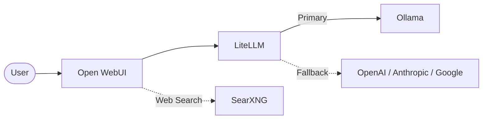

# 🚀 LocalLLM

> A self-contained, self-healing local AI platform installer for Windows.


[Screenshot/Demo Placeholder]

## 🤖 What is LocalLLM?

LocalLLM is a one-command installer that gives you a local AI assistant comparable to ChatGPT, Claude, or Gemini, running entirely on your machine. It deploys a robust stack via Docker Compose:

- **Privacy First**: Your data never leaves your machine unless you explicitly use cloud fallbacks.
- **No Subscriptions**: Run powerful open-source models for free.
- **Works Offline**: Fully functional even without an internet connection (using local models).
- **Cloud Fallback**: Seamlessly route to OpenAI, Anthropic, or Google when you need extra power.

## ✨ Features

- **Hardware-aware auto-configuration**: Automatically detects your system specs and configures the optimal models.
- **One-command installation**: Simple PowerShell script to get everything up and running.
- **ChatGPT-like web interface**: Powered by Open WebUI for a familiar, feature-rich experience.
- **RAG (Retrieval-Augmented Generation)**: Upload documents and ask questions about them.
- **Web search**: Private and secure web search integration via SearXNG.
- **Tool/function calling**: Models can interact with tools for advanced capabilities.
- **Multi-model support**: Easily switch between local and cloud models.
- **Intelligent cloud fallback**: Automatically route requests to OpenAI, Anthropic, or Google API.
- **Self-healing diagnostics**: Built-in health checks and automatic repair.
- **Clean install/uninstall**: Leaves no mess behind.
- **Management CLI**: Powerful command-line tool for managing your AI environment.

## 🚀 Quick Start

```powershell
git clone https://github.com/ebeauzec/LocalLLM.git
cd LocalLLM
.\install.ps1
```

## 💻 System Requirements

| Specification | Minimum | Recommended |
| ------------- | ------- | ----------- |
| **OS** | Windows 10/11 (64-bit) | Windows 10/11 (64-bit) |
| **RAM** | 8GB | 16GB+ |
| **GPU** | Optional (CPU only works) | NVIDIA GPU (for best performance) |
| **Disk** | 20GB free space | 50GB+ SSD |
| **Internet** | Required for initial setup | Broadband |

## 🏗️ Architecture



## 🧠 Hardware Tiers

| Tier | Hardware | Target Models |
| ---- | -------- | ------------- |
| **LOW** | 8GB RAM | Phi-4-mini 3.8B |
| **MEDIUM** | 16GB RAM | Llama 3.3 8B |
| **HIGH** | 32GB RAM | Qwen 3.6 14B + DeepSeek-R1 14B |
| **ULTRA** | 32GB+ RAM / 16GB+ VRAM | Qwen 3.6 27B + DeepSeek-R1 32B |

## 🛠️ Management Commands

| Command | Description |
| ------- | ----------- |
| `localllm start` | Starts all LocalLLM services |
| `localllm stop` | Stops all LocalLLM services |
| `localllm status` | Checks the status and health of the deployment |
| `localllm update` | Updates the models and containers to the latest versions |
| `localllm repair` | Runs self-healing diagnostics to fix common issues |
| `localllm models` | Lists currently installed models |
| `localllm uninstall` | Completely removes LocalLLM and its data |

## 🎯 Use Cases

1. **Private AI Assistant** - Chat without data leaving your machine. Perfect for sensitive or proprietary information.
2. **Document Analysis** - Upload PDFs, Word documents, or text files and ask questions about them (RAG).
3. **Code Assistant** - Get help with code generation, debugging, and code review securely.
4. **Research Tool** - Combine web search with AI analysis without tracking.
5. **Offline AI** - Stay productive even when traveling or disconnected from the internet.
6. **Team AI** - Host a shared instance on a powerful machine for your internal team.
7. **Development/Testing** - Test AI integrations locally without incurring API costs.
8. **Cost Savings** - Reduce expensive cloud API costs by offloading routine tasks to local models.

## 🤝 Contributing

We welcome contributions! Please see our [CONTRIBUTING.md](docs/CONTRIBUTING.md) for details on our code of conduct, bug reporting, and pull request process. Note that all contributions require signing a Contributor License Agreement (CLA).

## 📄 License

This software is proprietary. See the [LICENSE](LICENSE) file for terms.
Copyright (c) 2025-2026 Eugene Beauzec. All Rights Reserved.

## 🙏 Acknowledgments

This project builds upon amazing open-source software:
- [Ollama](https://ollama.ai/)
- [Open WebUI](https://openwebui.com/)
- [LiteLLM](https://litellm.ai/)
- [SearXNG](https://docs.searxng.org/)
- [Docker](https://www.docker.com/)
