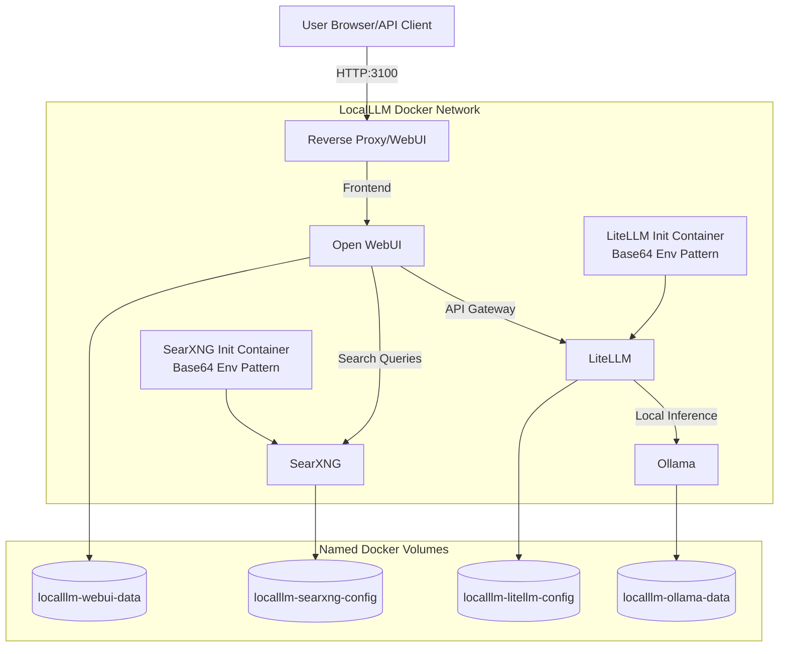

# 🚀 LocalLLM

> Enterprise-grade local AI platform. Your data never leaves your machine.


## 🌟 Feature Highlights

- 🔒 **Data Privacy Guard**: Your data never leaves your machine.
- 💾 **Robust Persistence**: Named Docker volumes (`localllm-ollama-data`, `localllm-webui-data`, `localllm-litellm-config`, `localllm-searxng-config`) replace fragile bind mounts.
- ⚡ **Init Container Pattern**: Secure base64 environment variables for LiteLLM and SearXNG configurations.
- 👥 **14 AI Personas**: Highly tuned models for any task from code review to storage engineering.
- 📚 **30+ Prompt Templates**: Pre-built templates for standard workflows.
- 🛠️ **12 Developer Tools**: Integrated tools including Code Executor, Document Parser, and Image Analyzer.
- ⏹️ **Graceful Shutdown**: New `stop.ps1` script ensures safe teardown and data consistency.
- 🔌 **Standard Port 3100**: WebUI now runs on port 3100 to avoid conflicts.

## 🏗️ Architecture



## 🚀 Quick Start

```powershell
# 1. Clone the repository
git clone https://github.com/ebeauzec/LocalLLM.git

# 2. Start the platform
cd LocalLLM
.\start.ps1

# 3. Gracefully stop when done
.\stop.ps1
```

## 👥 Persona Catalog (14 Specialized AI Roles)

| Name | ID | Description |
|---|---|---|
| General Assistant | `general-assistant` | All-purpose chat & Q&A |
| Reasoning Engine | `reasoning-engine` | Deep thinking with chain-of-thought |
| Code Developer | `code-developer` | Software engineering, code generation |
| Data Analyst | `data-analyst` | Statistics, pandas, visualization |
| Creative Writer | `creative-writer` | Content creation, storytelling |
| Security Analyst | `security-analyst` | Cybersecurity, code audits |
| Solutions Architect | `solutions-architect` | System design, architecture planning |
| Storage Engineer | `storage-engineer` | SAN/NAS management, storage migrations |
| Technical Account Manager | `tam` | QBR prep, client relationship management |
| Document Processor | `document-processor` | Structuring messy text, summarization |
| Project Manager | `project-manager` | Sprint planning, risk management |
| Technical Writer | `technical-writer` | API documentation, user guides |
| UX Researcher | `ux-researcher` | Usability analysis, UI feedback |
| SQL Expert | `sql-expert` | Advanced database querying and optimization |

> 📖 See [PERSONAS.md](docs/PERSONAS.md) for detailed prompt configurations and use cases.

## 📚 Prompt Library Highlights

LocalLLM includes over **30+ prompt templates** designed for enterprise workflows. From "Generate API Specs" to "Review Code Security," these templates jumpstart your productivity.

## 💻 Hardware Tiers

| Tier | Minimum RAM | Recommended Hardware | Supported Models |
|---|---|---|---|
| **Starter** | 8 GB | Any modern CPU | Phi-4-mini, Llama-3-8B |
| **Pro** | 16 GB | NVIDIA GPU (8GB VRAM) | Qwen-2.5-14B, DeepSeek-Coder |
| **Enterprise** | 32 GB+ | NVIDIA GPU (16GB+ VRAM)| DeepSeek-R1-32B, Llama-3-70B (quantized) |

## 📸 Screenshots


---
Copyright (c) 2025-2026 Eugene Beauzec. All Rights Reserved.
