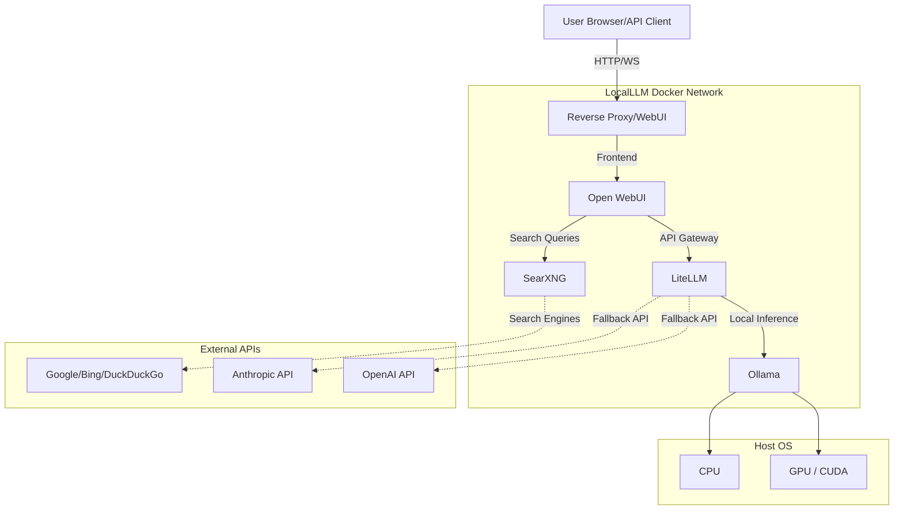

# Architecture

This document outlines the technical architecture of LocalLLM.

## System Architecture Diagram

## Core Components

1. **Open WebUI (Frontend & RAG Engine)**
   - Port: `3000`
   - Handles the user interface, authentication, and chat history.
   - Manages vector databases (ChromaDB) for Document RAG capabilities.

2. **LiteLLM (API Gateway & Routing)**
   - Port: `4000`
   - Acts as a unified OpenAI-compatible endpoint.
   - Handles load balancing, fallback routing (e.g., if local model is too slow, route to cloud), and API key management.

3. **Ollama (Inference Engine)**
   - Port: `11434`
   - Runs the GGUF model weights on CPU or GPU.
   - Exposes a local API that LiteLLM consumes.

4. **SearXNG (Metasearch Engine)**
   - Port: `8080`
   - A privacy-respecting metasearch engine used by Open WebUI's web search tools to fetch live data without tracking.

## Data Persistence

All data is stored in Docker volumes mapped to the `data/` directory in the repository:
- `data/ollama/`: Model weights and configurations
- `data/webui/`: SQLite database, user profiles, chat history, and vector embeddings
- `data/litellm/`: Routing configurations

## Security Considerations

- **Network Isolation**: All internal communication happens over a private Docker bridge network. Only Open WebUI exposes a port to the host machine.
- **Local Execution**: By default, no telemetry or data is sent externally.
- **Search Privacy**: SearXNG acts as a proxy for search queries, preventing search engines from profiling the user.

## API Endpoints

LiteLLM exposes a standard OpenAI-compatible API on `http://localhost:4000`. You can point external tools (like Cursor, VSCode, or custom scripts) to this endpoint using the dummy API key configured during setup.
