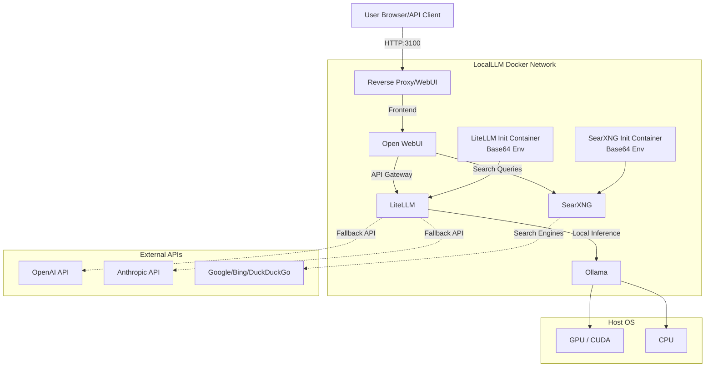

# Architecture

This document outlines the technical architecture of LocalLLM.

## System Architecture Diagram

## Core Components

1. **Open WebUI (Frontend & RAG Engine)**
   - Port: `3100` (Default WebUI port)
   - Handles the user interface, authentication, and chat history.
   - Manages vector databases for Document RAG capabilities.

2. **LiteLLM (API Gateway & Routing)**
   - Port: `4000`
   - Acts as a unified OpenAI-compatible endpoint.
   - Uses an **init container** pattern to dynamically generate and load its configuration from base64 encoded environment variables, avoiding bind mount issues.

3. **Ollama (Inference Engine)**
   - Port: `11434`
   - Runs the GGUF model weights on CPU or GPU.
   - Exposes a local API that LiteLLM consumes.

4. **SearXNG (Metasearch Engine)**
   - Port: `8080`
   - A privacy-respecting metasearch engine.
   - Uses an **init container** pattern to securely inject configuration via base64 encoded environment variables.

## Data Persistence

All data is stored securely using **named Docker volumes**, moving away from legacy host bind mounts. This improves cross-platform compatibility and stability (e.g., when running from Google Drive).

- `localllm-ollama-data`: Stores model weights and configurations.
- `localllm-webui-data`: Stores the SQLite database, user profiles, chat history, and vector embeddings.
- `localllm-litellm-config`: Stores generated routing configurations.
- `localllm-searxng-config`: Stores generated search engine configurations.

## Security Considerations

- **Network Isolation**: All internal communication happens over a private Docker bridge network. Only Open WebUI exposes a port (3100) to the host machine.
- **Local Execution**: By default, no telemetry or data is sent externally.
- **Search Privacy**: SearXNG acts as a proxy for search queries, preventing search engines from profiling the user.

## API Endpoints

LiteLLM exposes a standard OpenAI-compatible API on `http://localhost:4000`. You can point external tools to this endpoint using the dummy API key configured during setup.

---
Copyright (c) 2025-2026 Eugene Beauzec. All Rights Reserved.
