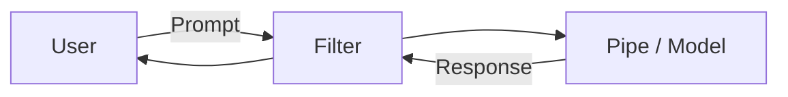

# LocalLLM Developer Guide

> **Copyright (c) 2025-2026 Eugene Beauzec. All Rights Reserved.**
> GitHub: [LocalLLM](https://github.com/ebeauzec/LocalLLM)

This guide covers advanced topics for developers looking to extend, customize, or integrate with the LocalLLM platform.

---

## Creating Custom Tools

Tools allow models to perform actions or retrieve real-time data.

### Tool Function Format
Tools are standard Python functions documented with type hints and docstrings. The platform automatically parses these into JSON schemas for the model.

```python
def fetch_weather(city: str, units: str = "metric") -> str:
    """
    Fetches the current weather for a given city.
    
    :param city: The name of the city (e.g., 'London', 'Tokyo').
    :param units: Temperature units, either 'metric' or 'imperial'.
    """
    # Implementation here
    return f"The weather in {city} is sunny."
```

### Valves (Configuration) System
Use "Valves" to expose configuration options (like API keys) to users via the UI, without hardcoding them in the tool.

### Async Function Signatures
For I/O bound operations, use `async def` to ensure the tool executes non-blocking.

### Testing Tools Locally
You can test tools via the internal Python environment before deploying them to the UI.

### Deploying Tools to Open WebUI
Upload the Python script in the **Workspace > Tools** section of the interface.

---

## Creating Custom Model Profiles

Create specialized personas using Modelfiles.

### Modelfile Format
LocalLLM uses standard Ollama Modelfiles.

```dockerfile
FROM llama3
SYSTEM """
You are a senior database architect.
Provide highly optimized SQL queries.
Always explain the query execution plan.
"""
PARAMETER temperature 0.2
PARAMETER num_ctx 8192
```

### System Prompt Best Practices
*   Be specific about role and tone.
*   Define clear constraints (e.g., "Do not use markdown formatting").
*   Provide examples of desired inputs and outputs (Few-shot prompting).

### Parameter Tuning Guide
*   **Temperature:** Low (0.1-0.3) for factual/coding tasks. High (0.7-1.0) for creative tasks.
*   **Top P:** Alternatives to temperature; controls diversity of token selection.
*   **Context Length (num_ctx):** Increase for processing large documents, but be aware of higher VRAM usage.

---

## Creating Pipelines

Pipelines allow you to modify prompts before they reach the model, or modify responses before they reach the user.

### Pipeline Architecture


*   **Filter Pipelines:** Intercept and modify messages. Good for logging, content moderation, or appending context.
*   **Pipe Pipelines:** Replace the model entirely. Good for routing requests to external APIs or custom RAG implementations.

### Example: Custom Reasoning Pipeline
You can create a pipeline that intercepts a prompt, asks a small model to generate a search query, performs the search, and appends the results to the original prompt before sending it to the main model.

---

## Adding MCP Servers

Model Context Protocol (MCP) servers expose resources to LocalLLM.

### Building with fastmcp
The easiest way to build a custom MCP server in Python is using `fastmcp`.

```python
from fastmcp import FastMCP

mcp = FastMCP("MyDatabaseServer")

@mcp.tool()
def query_db(sql: str) -> str:
    """Execute a SELECT query on the reporting database."""
    # ... execution logic ...
    return results

if __name__ == "__main__":
    mcp.run()
```

### Connecting via MCPO proxy
If running MCP servers on a different host, use an MCPO proxy to expose them over SSE.

### Example: Database Connector
An MCP server can provide read-only access to a Postgres database, allowing the model to analyze live business metrics autonomously.

---

## API Integration

LocalLLM exposes a robust API for programmatic access.

### OpenAI-Compatible Endpoints
The platform acts as a drop-in replacement for OpenAI's API.
Base URL: `http://localhost:3000/api/v1`

### Authentication
Generate Bearer tokens in the User Settings panel.

### Example (Python with OpenAI SDK)
```python
from openai import OpenAI

client = OpenAI(
    base_url="http://localhost:3000/api",
    api_key="your-localllm-api-key"
)

response = client.chat.completions.create(
    model="llama3",
    messages=[
        {"role": "system", "content": "You are a helpful assistant."},
        {"role": "user", "content": "Write a python script to parse CSV."}
    ]
)
print(response.choices[0].message.content)
```

---

## Contributing

We welcome contributions to LocalLLM!

### Development Setup
1. Clone the repository.
2. Run `docker-compose up -d --build`
3. The frontend is accessible at `http://localhost:3000`

### Testing Guidelines
Ensure all new features include appropriate tests. Run `pytest` before submitting changes.

### Submitting Changes
1. Fork the repository.
2. Create a feature branch (`git checkout -b feature/amazing-feature`).
3. Commit your changes.
4. Push to the branch.
5. Open a Pull Request.
