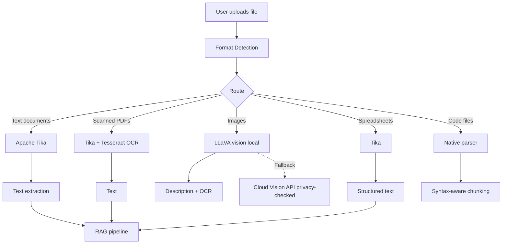

# Document Processing Pipeline

## Supported Formats

| Category | Formats | Engine |
|:---|:---|:---|
| Documents | PDF, DOCX, DOC, ODT, RTF, TXT | Apache Tika |
| Spreadsheets | XLSX, XLS, CSV, ODS | Apache Tika |
| Presentations | PPTX, PPT, ODP | Apache Tika |
| Web | HTML, XHTML, XML, MHTML | Apache Tika |
| E-books | EPUB, MOBI | Apache Tika |
| Email | EML, MSG, MBOX | Apache Tika |
| Archives | ZIP, TAR, GZIP, 7Z | Apache Tika |
| Images (OCR) | PNG, JPG, JPEG, TIFF, BMP, GIF, WebP | Tika + Tesseract |
| Images (Vision) | PNG, JPG, JPEG, WebP | LLaVA (local) |
| Markdown | MD, MDX | Native |
| Code | PY, JS, TS, JAVA, C, CPP, RS, GO, etc. | Native |
| Data | JSON, YAML, TOML, XML, CSV | Native |

## Architecture

## Privacy-Aware Cloud Fallback

When a local vision model (like LLaVA) fails or encounters an unsupported format, the system can gracefully fall back to Cloud APIs. This process is fully mediated by our **Privacy Audit Filter**.

*   **Trigger**: Local processing failure or user explicitly selects a cloud model.
*   **STRICT Mode**: Cloud fallback is immediately blocked.
*   **BALANCED Mode**: Cloud fallback proceeds, but if sensitive data (PII, API keys) is detected, the user is warned. If `block_on_sensitive` is true, the request is blocked.
*   **PERMISSIVE Mode**: Cloud fallback proceeds. Any sensitive patterns detected are automatically redacted before leaving the local network.
*   **Audit Log**: All requests are logged to `/app/backend/data/privacy-audit.jsonl` containing the timestamp, destination, and a SHA256 content hash. *Content itself is never logged.*
*   **Dashboard**: View the privacy report at `http://localhost:3000/privacy`.

## How to Use

1.  **Upload**: Use the Open WebUI chat interface (drag-and-drop or click the paperclip icon).
2.  **Reference**: Mention documents in your prompt using the `#` command.
3.  **Knowledge Base**: Create collections in the workspace to group related documents.
4.  **Vision**: Use the Image Analyzer tool for dedicated vision tasks.

## Configuration

*   **Tika OCR Language**: Update `tika-config.xml` parameters to support additional languages (e.g., `eng+fra`).
*   **RAG Chunk Size**: Set the chunking parameters in Open WebUI settings -> Document Processing.
*   **Embedding Model**: Select your preferred local embedding model (e.g., `nomic-embed-text`) in the Admin panel.
*   **Vision Model**: Ensure `llava` or `llama3.2-vision` is pulled via Ollama for local image analysis.

## Troubleshooting

*   **Document shows "Content empty"**: The native parser might have failed. Ensure the Tika extraction engine is enabled for that file type.
*   **OCR not working**: Verify that the `tika-full` container (which includes Tesseract) is running.
*   **Image analysis fails**: Check that the LLaVA model is properly installed and selected in the vision settings.
