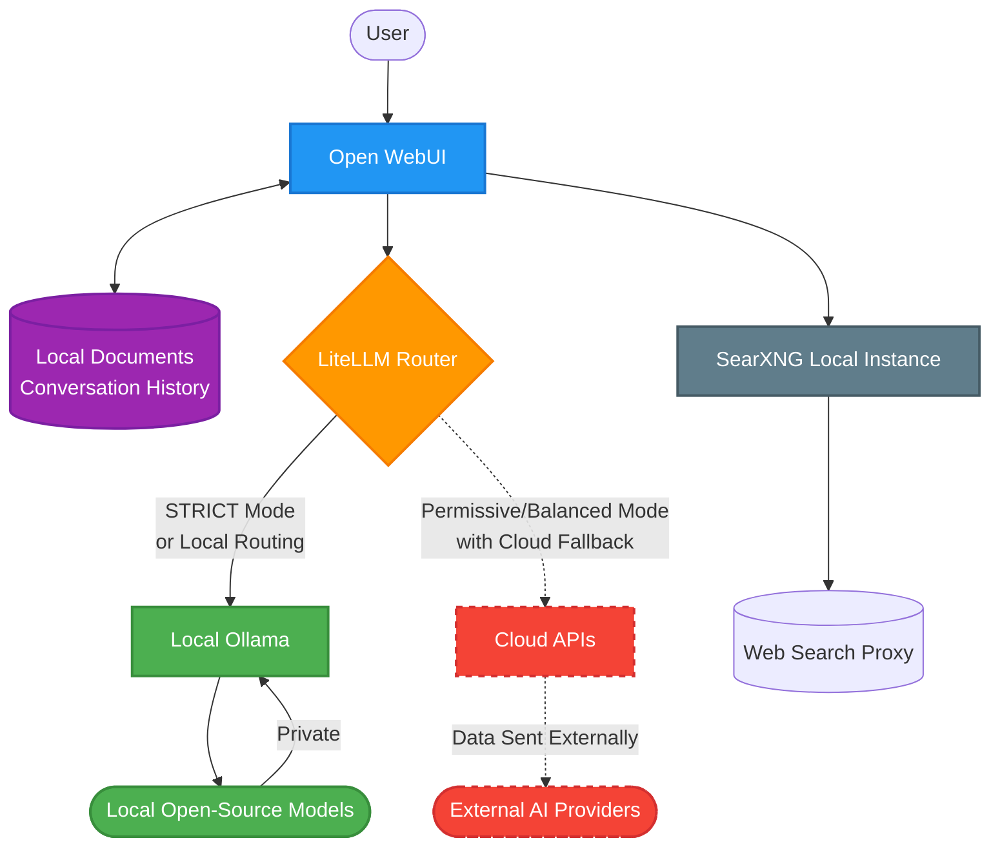

# Privacy and Data Security

**Copyright (c) 2025-2026 Eugene Beauzec. All Rights Reserved.**  
GitHub: [ebeauzec/LocalLLM](https://github.com/ebeauzec/LocalLLM)

---

## 1. Privacy Philosophy

LocalLLM is **LOCAL-FIRST by design**. Your data stays on **YOUR machine** unless you explicitly choose otherwise. 

We believe that artificial intelligence should empower you without compromising your privacy. Our core tenets are:
- **Zero Telemetry**: No tracking, no data collection, no phone-home functionality.
- **Local by Default**: All AI processing, RAG (Retrieval-Augmented Generation), and web searching happen locally.
- **Absolute Control**: You have complete transparency and control over when, if ever, your data is sent to external cloud APIs.

## 2. Data Flow and Privacy

The following diagram illustrates how data flows within LocalLLM and the strict boundaries that keep your data secure.

### What Stays Local vs. What Goes to Cloud

- **ALWAYS Local**:
  - Uploaded documents and files for RAG
  - Conversation history
  - Web searches (via our internal, un-tracked SearXNG instance)
  - System prompts and configuration
- **POTENTIALLY Sent to Cloud**:
  - ONLY prompts that are explicitly routed to cloud models (e.g., OpenAI, Anthropic) via LiteLLM.
  - *Note: Cloud fallback must be explicitly configured and permitted by your active Privacy Mode.*

## 3. Privacy Modes

LocalLLM offers three distinct privacy modes to suit different environments, from top-secret corporate networks to rapid development workstations.

### STRICT Mode (Maximum Privacy)
- **Behavior**: All processing stays entirely local. Zero cloud API calls are allowed, regardless of model failure or routing rules.
- **Best for**: Handling classified data, corporate secrets, personal medical/financial info.
- **Trade-off**: Limited to the capabilities of local open-source models; if a local model fails, the request fails safely.
- **How to enable**: `.\localllm.ps1 privacy strict`

### BALANCED Mode (Default)
- **Behavior**: Prefers local processing. If a task requires a cloud model, the system scans the content for sensitive data before any request leaves your machine. It warns the user and asks for confirmation before sending the prompt to the cloud.
- **Auto-Detection**: Scans for credit cards, SSNs, API keys, internal IPs, connection strings, etc.
- **Best for**: General business use where some cloud access is acceptable for complex tasks, but accidental data leaks must be prevented.

### PERMISSIVE Mode
- **Behavior**: Prefers local but allows cloud routing without user prompting. It still auto-redacts detected sensitive data before transmission.
- **Best for**: Development and testing environments with non-sensitive data.

## 4. Sensitive Data Detection

In Balanced and Permissive modes, LocalLLM actively scans outbound cloud requests for the following patterns to prevent accidental leaks:

| Data Type | Description |
| :--- | :--- |
| **Credit Card Numbers** | Standard PAN formats (Visa, Mastercard, Amex, etc.) |
| **Social Security Numbers** | US SSN formats |
| **API Keys / Tokens** | Common token formats (AWS, GitHub, Slack, OpenAI, etc.) |
| **Private Keys / Certificates** | RSA, DSA, EC private keys and PEM blocks |
| **Database Connection Strings** | Passwords embedded in Postgres, MySQL, MongoDB URIs |
| **Internal IP Addresses** | `10.x.x.x`, `172.16-31.x.x`, `192.168.x.x` |
| **Internal File Paths** | Paths indicating internal network shares or sensitive local directories |
| **Custom Blocklist** | User-defined regex patterns and terms specific to your organization |

## 5. Corporate Use Case

LocalLLM is designed for seamless integration into corporate environments where data sovereignty is paramount.

### Why Run AI Locally?
- **IP Protection**: Protect proprietary code, internal strategies, and trade secrets.
- **Compliance**: Meet stringent requirements for GDPR, HIPAA, and SOC 2 by keeping data within your established security perimeter.
- **Data Residency**: Guarantee that all processing occurs on your controlled hardware.

### Corporate Deployment Features
- **Strict Mode Enforcement**: Lock the environment down for sensitive departments (Legal, HR, R&D).
- **Custom Blocklists**: Populate `privacy-blocklist.txt` with company-specific terms (e.g., internal project codenames).
- **Audit Trails**: Maintain compliance records via the `privacy-audit.json` log, which tracks all privacy mode changes and blocked transmissions.
- **Network Isolation**: Easily apply firewall rules to block known cloud API endpoints, adding a defense-in-depth layer against misconfiguration.
- **Multi-User Ready**: Deploy safely for teams, knowing that underlying data is not being exfiltrated.

## 6. Cost Optimization

Running AI locally isn't just about privacy; it's a massive cost-saving measure.

### Cost Comparison

| Provider / Method | Pricing Model | Estimated Cost per 1M Tokens | Data Privacy |
| :--- | :--- | :--- | :--- |
| **LocalLLM (Local Models)** | Hardware only (Free per query) | **$0.00** | **100% Private** |
| **Cloud APIs (e.g., GPT-4)** | Pay-per-token | $10.00 - $30.00+ | Subject to Provider Terms |

### How LocalLLM Saves Money
- **Local-First Routing**: LiteLLM routes requests to local Ollama models by default, saving tokens/credits on every query.
- **Cost-Based Routing**: LiteLLM can be configured to use the cheapest available model capable of fulfilling the request.
- **Smart Fallback**: Cloud APIs are only triggered as a fallback if the local model fails or if a specific complex capability is explicitly requested.
- **Privacy Cost Report**: Run `.\localllm.ps1 privacy report` to see estimated cost savings generated by keeping workloads local.
- **Maximizing Performance**: By tuning your local hardware and model selection, you can reduce cloud dependence to near zero for day-to-day tasks.

## 7. Data Storage

All data is stored directly on your machine. You have full control over these directories.

- **Conversation History**: `data/open-webui/`
- **Uploaded Documents (RAG)**: `data/open-webui/`
- **Model Weights**: `data/ollama/`
- **Configuration**: `config/` (Never uploaded or shared)
- **Privacy Audit Log**: `data/privacy-audit.json`

*Security Recommendation: Ensure your host operating system utilizes Full Disk Encryption (e.g., BitLocker, FileVault, LUKS) to protect data at rest.*

## 8. Network Security

LocalLLM's architecture is secure by default:
- **Localhost Only**: All services bind to localhost (`127.0.0.1`). They are not exposed to your local network or the internet by default.
- **Docker Isolation**: Services run in an isolated Docker network bridge.
- **No Outbound Exfiltration**: There are no outbound connections made except when Cloud Fallback is explicitly used.
- **Private Web Search**: The included SearXNG instance proxies all web searches. Your IP address is hidden from search engines like Google and Bing, and tracking scripts are stripped.
- **Firewall Integration**: We recommend creating host firewall rules to completely block outbound access to cloud API endpoints if STRICT mode is mandated.

## 9. Compliance Considerations

- **GDPR**: Data never leaves your jurisdiction. Processing occurs entirely on your hardware.
- **HIPAA**: In STRICT mode, Protected Health Information (PHI) is never sent to the cloud, eliminating BAA (Business Associate Agreement) complexities with external AI vendors.
- **SOC 2**: The `privacy-audit.json` provides an auditable trail of privacy enforcement.
- **Data Sovereignty**: Complete ownership and control over where and how your data is processed.

## 10. Privacy Checklist

To achieve maximum privacy and security, follow this checklist after deploying LocalLLM:

- [ ] Set privacy mode to STRICT (`.\localllm.ps1 privacy strict`)
- [ ] Do not configure any cloud API keys in LiteLLM
- [ ] Review and customize `privacy-blocklist.txt` with your organization's sensitive terms
- [ ] Run `.\localllm.ps1 privacy report` periodically to audit system behavior
- [ ] Optionally block cloud API endpoints (e.g., `api.openai.com`) at your network firewall level
- [ ] Ensure users use the local SearXNG integration for web search instead of standard browsers

---
*For more information on configuring privacy features, refer to the main documentation.*
